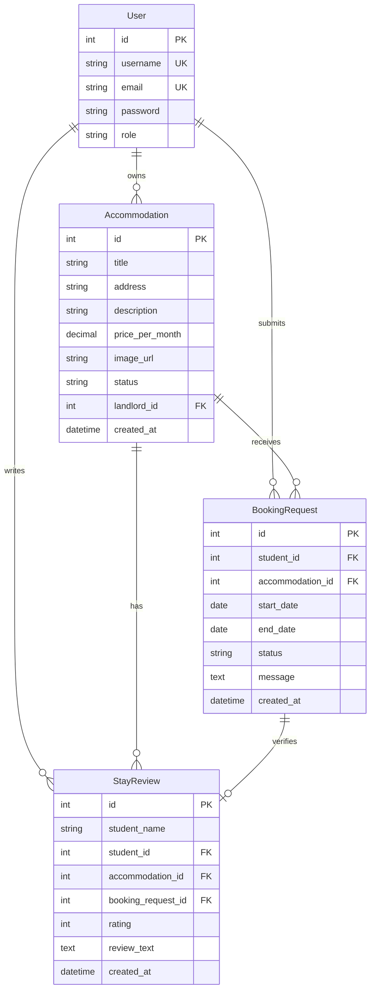

# COMP 3613 Assignment 1

Draft this file with the Guide. **Update it after every phase milestone** before you pause. The use-case diagram is a UML PNG at `docs/diagrams/use-case.png`, linked from this file as `diagrams/use-case.png` (path relative to `docs/report.md`). The model diagram is Mermaid. **Embed wireframe images** as `wireframes/<file>` (files live in `docs/wireframes/`).

Do not put your student ID in this file if you will commit it. The PDF cover adds your name and ID at export time.

## Assigned project

Student Accommodation

## Three workflows

### 1. Search and request accommodation (Student)

### 2. Review and manage booking requests (Landlord)

### 3. Review a completed stay (Student)

## Use case diagram

Student is directly associated with Search Accommodation, View Booking Status, Request Accommodation, and View Listing Details. View Listing Details is a standalone use case, not an extension. Student and Landlord share Sign In. Approve or Decline Booking Request optionally extends Review Booking Requests, so a landlord may leave a request pending. Reviewing a completed stay remains a Student use case.

## Model diagram

First draft. Update this section in Phase 5 when polish revises the model, and note what changed.

The implementation uses one `User` table with `role=regular_user` for students and `role=admin` or `role=landlord` for landlords. A user can submit many booking requests, each tied to one accommodation and one request window defined by start_date and end_date. Each approved booking can later become completed and receive one StayReview. Each accommodation belongs to one landlord user and may receive many requests over time. Seeded listings use remote apartment image URLs, while landlord-uploaded images are stored under `app/static/uploads`; both are represented by `image_url`. The code exposes `price_per_month`; its SQLModel column keeps the legacy physical column name `price_per_week` for existing database compatibility.

## Wireframes

### Student Accommodation wireframe set

This wireframe covers the core student and landlord flows: search/listing, request and booking state, landlord approval, review and completed stay feedback. It matches the project model and use-case draft closely, though the request lifecycle could be clearer at the handoff between the student’s “My Bookings” screen and the landlord “Request Details” action.

## Theming

Student Accommodation uses a modern, trustworthy, and welcoming tone. The wordmark and main landing heading use Fraunces, paired with Source Sans 3 for navigation, forms, buttons, and body text. The palette uses primary burgundy `#A6192E`, pressed burgundy `#801326`, brighter accent `#C6283E`, warm background `#FAF7F5`, white cards and forms, `#222222` main text, `#666666` secondary text, and `#E5E1DE` borders.

The landing page now presents a dark-to-burgundy gradient with a large white Student Accommodation wordmark, a short welcoming introduction, and separate Create student account, Student sign in, and Landlord sign in actions. Landing, login, and register pages no longer use starter branding or demo copy. Starter authentication and `/config` remain available.

## Implementation notes

### Workflow 1 — Search and request accommodation (Student)

The accommodation domain was added through the layered architecture: the `Accommodation` and `BookingRequest` SQLModel tables, an accommodation repository, an accommodation service, and a thin authenticated search route. The student search page is reachable from the authenticated home screen, supports title search, shows available listing cards, and has an empty state. Initialization now seeds a landlord account and a Riverside House listing so the workflow can be exercised locally.

Verification note: the student ran the app, signed in as `bob`, opened Search accommodation, and confirmed that searching works after initialization.

The request form and booking state follow the wireframe as a separate flow: search results link to an accommodation details page, the student submits start/end dates and an optional message there, and the app redirects to My Bookings with a pending status.

Verification note: the student confirmed the separate details page works, the request form submits, and the request appears in My Bookings.

Polish update: My Bookings now resolves each request to its accommodation title and address through the repository layer instead of displaying only an internal accommodation ID.

Verification note: the student confirmed the polished My Bookings card displays the accommodation information correctly. Further Workflow 1 polish may continue before starting Workflow 2.

Final polish note: the authenticated sidebar was replaced with a responsive top navigation bar matching the wireframe, with Home, Search, My Bookings, welcome text, and Logout actions. The student confirmed the updated navigation works across the workflow pages.

Workflow 1 is ready for the next workflow milestone.

### Workflow 2 — Review and manage booking requests (Landlord)

The landlord review flow uses the same layered architecture and ownership checks. The Booking requests page summarizes each request with the student username, listing, requested duration, status, and a View request action. The detail page shows the student, listing, duration, optional message, and approve/decline controls. Decisions are limited to pending requests, persist through the service and repository layers, and return to the booking list with an approval or decline message. The admin account is the project landlord account for this workflow.

Verification note: the student confirmed the landlord summary page, request detail page, decision flow, final decision behavior, and return message all work as intended.

### Workflow 3 — Review a completed stay (Student)

The student review flow is attached to My Bookings rather than exposed as a separate navigation tab. An approved booking becomes Completed after its end date, and the booking then shows a Review stay action. The dedicated review page accepts a 1-to-5 rating and written comment, enforces one review per completed booking, and then displays the finished review with a Return to my bookings action.

Verification note: the student confirmed the review submission works after the existing review-table schema mismatch was corrected by restoring and populating the required student name field.

## Deployed app

Phase 6. Public Render URL (not localhost). Markers open this to mark the three workflows.

https://

## Logins

Every account a marker needs, including extra users you added. Starter accounts:

- bob / bobpass — regular user
- admin / adminpass — admin

## YouTube URL

## Session transcripts

Filled when the Guide builds the report: the agent writes each Guide chat to `docs/transcripts/<slug>.md` (Copilot Agent, Cursor, or OpenCode). `python manage.py report` packages them. Do not paste chats here during the build.

## Competency (student-judge)

Filled when the report is built. Guide runs student-judge, writes `docs/judge.md`, and export appends the scorecard here.

## Skill integrity

Filled by `python manage.py report`. Do not edit the course skills.
