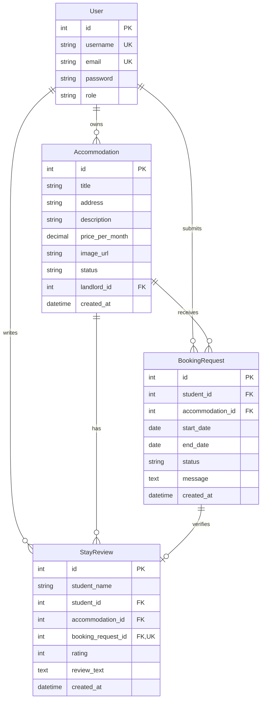

<!-- student-build:skill-integrity
status: pass
root: e84cd692d0b85eefe546385661958c27d07e8be6c5176a82012f68ccff5c8beb
expected_root: e84cd692d0b85eefe546385661958c27d07e8be6c5176a82012f68ccff5c8beb
mismatches: none
-->

# COMP 3613 Assignment 1

Draft this file with the Guide. **Update it after every phase milestone** before you pause. The use-case diagram is a UML PNG at `docs/diagrams/use-case.png`, linked from this file as `diagrams/use-case.png` (path relative to `docs/report.md`). The model diagram is Mermaid. **Embed wireframe images** as `wireframes/<file>` (files live in `docs/wireframes/`).

Do not put your student ID in this file if you will commit it. The PDF cover adds your name and ID at export time.

## Assigned project

Student Accommodation

## Three workflows

### 1. Search and request accommodation (Student)

### 2. Review and manage booking requests (Landlord)

### 3. Review a completed stay (Student)

## Use case diagram

Student is directly associated with Search Accommodation, View Booking Status, Request Accommodation, and View Listing Details. View Listing Details is a standalone use case, not an extension. Student and Landlord share Sign In. Approve or Decline Booking Request optionally extends Review Booking Requests, so a landlord may leave a request pending. Reviewing a completed stay remains a Student use case.

## Model diagram

First draft. Update this section in Phase 5 when polish revises the model, and note what changed.

The implementation uses one `User` table with `role=regular_user` for students and `role=admin` or `role=landlord` for landlords. A user can submit many booking requests, each tied to one accommodation and one request window defined by start_date and end_date. Each approved booking can later become completed and receive one StayReview. Each accommodation belongs to one landlord user and may receive many requests over time. Seeded listings use remote apartment image URLs, while landlord-uploaded images are stored under `app/static/uploads`; both are represented by `image_url`. The code exposes `price_per_month`; its SQLModel column keeps the legacy physical column name `price_per_week` for existing database compatibility.

## Wireframes

### Student Accommodation wireframe set

This wireframe covers the core student and landlord flows: search/listing, request and booking state, landlord approval, review and completed stay feedback. It matches the project model and use-case draft closely, though the request lifecycle could be clearer at the handoff between the student’s “My Bookings” screen and the landlord “Request Details” action.

### COMP3613 A1 Wireframe

## Theming

Student Accommodation uses a modern, trustworthy, and welcoming tone. The wordmark and main landing heading use Fraunces, paired with Source Sans 3 for navigation, forms, buttons, and body text. The palette uses primary burgundy `#A6192E`, pressed burgundy `#801326`, brighter accent `#C6283E`, warm background `#FAF7F5`, white cards and forms, `#222222` main text, `#666666` secondary text, and `#E5E1DE` borders.

The landing page now presents a dark-to-burgundy gradient with a large white Student Accommodation wordmark, a short welcoming introduction, a five-photo apartment carousel, and separate Create account, Student sign in, and Landlord sign in actions. Registration supports student and landlord roles, and sign-in screens enforce the selected role. Login and register pages no longer use starter branding or demo copy. Starter authentication and `/config` remain available.

## Implementation notes

### Workflow 1 — Search and request accommodation (Student)

The accommodation domain uses `Accommodation` and `BookingRequest` SQLModel tables, an accommodation repository, a service, and thin authenticated routes. Student search supports title search and sorting by newest, lowest monthly rent, highest monthly rent, and highest review rating. Listings display images, Trinidad and Tobago addresses, and TT$ monthly rent. The non-destructive `seed` command adds Tobago/Trinidad sample apartments and pending student requests; `init` resets the database and recreates the sample set.

Verification note: the student ran the app, signed in as `bob`, opened Search accommodation, and confirmed that searching works after initialization.

The request form and booking state follow the wireframe as a separate flow: search results link to an accommodation details page, the student submits start/end dates and an optional message there, and the app redirects to My Bookings with a pending status.

Verification note: the student confirmed the separate details page works, the request form submits, and the request appears in My Bookings.

Polish update: My Bookings is a responsive list showing a property thumbnail, listing/address, dates, status, and a review action for completed stays. Requests are validated for available listings and valid date order; the confirmation page shows the apartment image, address, duration, TT$ monthly rent, and pending status.

Verification note: the student confirmed search, details, booking submission, My Bookings, and booking confirmation work. Additional list sizing and review-page star interactions were polished from student feedback.

Final polish note: the authenticated sidebar was replaced with a responsive top navigation bar matching the wireframe. Landlords can manage owned properties through My Property, create/edit listings, and upload images. Uploaded images take precedence over seeded remote photos; placeholders remain as fallback.

Workflow 1 is ready for the next workflow milestone.

### Workflow 2 — Review and manage booking requests (Landlord)

The landlord review flow uses ownership-scoped repository queries and a role-protected route. Booking requests is a responsive list with All/Pending/Approved/Declined filters; All sorts newest first. Only pending requests can be opened for a decision. Approve/decline decisions are final and lead to an outcome page with listing details and the decision banner. Approved bookings can be marked complete after their end date, and remain available through View details. Landlords can clear declined requests. The `admin` account represents the landlord in the seeded dataset.

Verification note: the student confirmed the landlord summary page, request detail page, decision flow, final decision behavior, and return message all work as intended.

### Workflow 3 — Review a completed stay (Student)

The student review flow is attached to My Bookings rather than exposed as a separate navigation tab. An approved booking becomes Completed after its end date, and the booking then shows a Review stay action. The review page accepts a 1-to-5 rating and written comment, validates completed/approved ownership in the service/repository path, and enforces one review per booking with a unique database index. It displays the saved review with a Return to my bookings action. The page includes the listing image and an interactive star control.

Verification note: the student confirmed the review submission works after the existing review-table schema mismatch was corrected by restoring and populating the required student name field.

## Deployed app

Phase 6. Public Render URL (not localhost). Markers open this to mark the three workflows.

https://

## Logins

Every account a marker needs, including extra users you added. Starter accounts:

- bob / bobpass — student
- alice / alicepass — student
- carmen / carmenpass — student
- admin / adminpass — landlord (admin role)

## YouTube URL

## Session transcripts

Filled when the Guide builds the report: the agent writes chat markdown into `docs/transcripts/`; `python manage.py report` packages them.

Guide packaged **5** chat(s) in `docs/transcripts/` (and `docs/transcripts.zip`).

Index: [docs/transcripts/INDEX.md](transcripts/INDEX.md)

- [`phase1-copilot`](transcripts/phase1-copilot.md)
- [`phase2-copilot`](transcripts/phase2-copilot.md)
- [`phase3-copilot`](transcripts/phase3-copilot.md)
- [`phase4-copilot`](transcripts/phase4-copilot.md)
- [`phase5-copilot`](transcripts/phase5-copilot.md)

## Competency (student-judge)

Filled by Guide from the student-judge run when this report was built.

**Judged at:** 2026-10-06
**Student / session:** Student Accommodation / GitHub Copilot Guide sessions for `comp3613a1`
**Evidence pass:** Re-read four native GitHub Copilot Chat sessions, the current Phase 5 Guide session, current `docs/report.md`, use-case diagram source/PNG, wireframe image, and five Guide-written transcript records. Prior transcript summary was replaced because its demo accounts/tests/deployment claims did not match the workspace.
**Phases in evidence:** 1–6 (COMP 3613; Phase 5 polish, Phase 6 deploy)

### Totals
| | Count / value |
|--|--|
| Metrics on rubric | 12 (M1–M12) |
| N/A (excluded) | 0 |
| Metrics scored | 12 |
| Scoreable max | 48 |
| Awarded total | 41 / 48 |
| **Overall (avg of scored)** | **3.4 / 4** |
| Impression mark | 17 / 20 |

## Scorecard

| ID | Metric | Score / 4 | In avg | Evidence |
|----|--------|----------:|:------:|----------|
| M1 | Phase discipline | 4 | yes | Phases 1–4 artifacts preceded Phase 5; workflows were built in sequence. Student said, “yes but dont move to workflow 2 as yet.” No premature Phase 6 work. |
| M2 | Problem framing | 3 | yes | Student named three `Feature (user)` workflows, chose shared Sign In and View Listing Details relationships, and revised the ERD with date/FK requirements. |
| M3 | Decision ownership | 4 | yes | Student repeatedly owned product decisions, including “admin = landlord”, the separate request-details flow, role-specific sign-in, and Trinidad and Tobago seed data. |
| M4 | Artefact-before-code | 3 | yes | Phase 2 use-case PNG, Phase 3 ERD, and Phase 4 wireframe were present and used. The ERD was later reconciled with the implemented role-based User table. |
| M5 | Verification habit | 3 | yes | Student verified each core workflow (“it works now”, “yes it works”, “This is good and works”, “that works now”) and continued steering polish. Late visual/data refinements were not all re-verified. |
| M6 | Assignment fit | 3 | yes | Implementation follows Routes → Dependencies → Schemas → Services → Repositories → Models; routers call services, and the models/ERD align. Phase 6 remains outstanding. |
| M7 | Slice explanation | 2 | yes | Student engaged with the SQLModel and thin-route checks, but the marked model snippets were already filled by the Guide and remain marked `STUDENT SNIPPET` in source; the student confirmed rather than visibly completing those model edits. |
| M8 | Prompt quality | 4 | yes | Student prompts were phase-aware and specific, including “This works however i want this to be in another page following the wireframe” and later focused polish requests. |
| M9 | Response to pushback | 4 | yes | Student continuously refined mismatches instead of accepting the first build: “This messes up the site, i want the image to be to the right of the screen to fill up the empty space.” |
| M10 | Integrity | 4 | yes | No paste dump, answer-seeking, or instruction override observed. Student corrections were grounded in the project; `python manage.py skills-verify` passed. |
| M11 | Provenance continuity | 3 | yes | The same three workflows, use-case decisions, ERD changes, and wireframe carry through all phases. The stale transcript summary was replaced with session-backed records. |
| M12 | Sincerity trajectory | 4 | yes | No suspicion spiral was needed; turns remained consistent and goal-directed, e.g. “okay this is good.” |

## Strengths
- Strong ownership of all three workflows and repeated corrections to match the student-created wireframe.
- Sustained Phase 5 polish across search, bookings, landlord review, completed-stay review, role-aware authentication, and visual design.
- Student verified the core workflows and reported concrete failures, including search data and review submission, which led to root-cause fixes.
- ERD and model relationships were reconciled; startup and schema checks pass.

## Gaps (priority order)
1. The required SQLModel snippet was not visibly authored by the student; source still contains `STUDENT SNIPPET` markers for Accommodation status, BookingRequest status, and StayReview rating. Practice making and explaining one small model change in each workflow.
2. Phase 6 deployment is not complete: no public Render URL or deployed workflow verification is recorded.
3. The YouTube presentation URL is still blank in `docs/report.md`.
4. The repository has no collected pytest tests. Core workflows were manually verified, but there is no automated regression coverage; the latest property/image and landing-carousel refinements also lack an explicit student click-through note.

## Phase gate status
| Phase | Status | Note |
|-------|--------|------|
| 1 | met | Student selected Student Accommodation and named three workflows. |
| 2 | met | Use-case relationships and layout were student-steered; UML source and PNG exist. |
| 3 | met | ERD exists and student requested date-range and review-verification fields. |
| 4 | met | Student wireframe is embedded in the report and covers the three workflows. |
| 5 | met | Theme, one-workflow-at-a-time implementation, student verification, and substantial polish are recorded. Model-snippet authorship remains a learning gap. |
| 6 | not met | No public Render URL or deployed Postgres/web service is recorded. |

## Recommended next practice
- Before deployment, add a small focused test set for date validation, final landlord decisions, and one-review-per-booking; then complete a final local click-through of property image upload/edit and the landing carousel.

## Integrity note
- Clean. No laundering flags or sincerity blocks were found. Course skill integrity verification passed. An earlier transcript summary contained claims inconsistent with the current workspace; it was replaced using the available session records.

## Provenance flags
- No student-authored paste dump or instruction override observed.
- The current workspace has a Phase 5 session and four earlier Guide sessions in the local Copilot session store; the transcript index now records all five.

## Sincerity log summary
- Blocks found: 0 | max round: N/A | min/mean/final confidence: N/A | trend: N/A | cleared: N/A (no suspicion protocol needed)

## Skips
- Skips: 0/3 used (from Guide record).

## Skill integrity

Course skills are hashed at export and compared to `.agents/skills.lock.json`. Do not edit `.agents/skills/`, `.cursor/skills/`, or `AGENTS.md`.

- Status: **pass**
- Root: `e84cd692d0b85eefe546385661958c27d07e8be6c5176a82012f68ccff5c8beb`
- none
