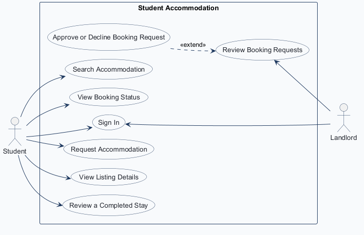
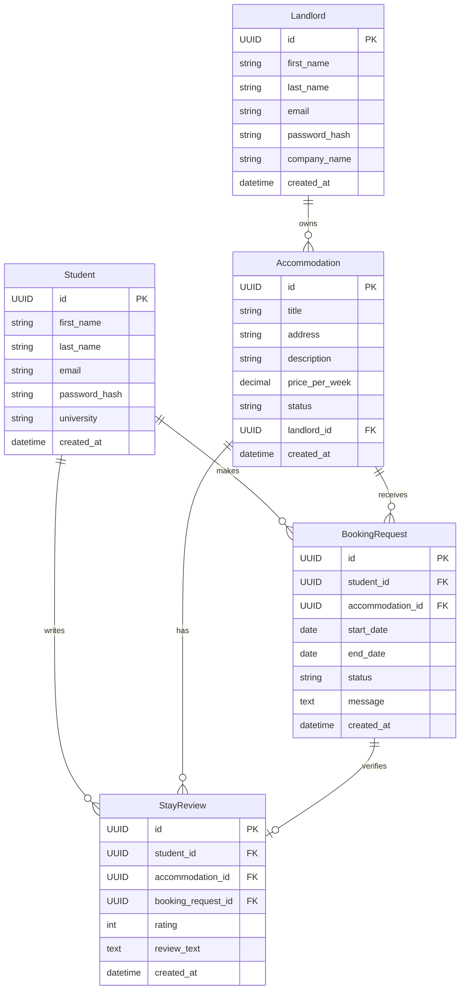

# COMP 3613 Assignment 1

Draft this file with the Guide. **Update it after every phase milestone** before you pause. The use-case diagram is a UML PNG at `docs/diagrams/use-case.png`, linked from this file as `diagrams/use-case.png` (path relative to `docs/report.md`). The model diagram is Mermaid. **Embed wireframe images** as `wireframes/<file>` (files live in `docs/wireframes/`).

Do not put your student ID in this file if you will commit it. The PDF cover adds your name and ID at export time.

## Assigned project

Student Accommodation

## Three workflows

### 1. Search and request accommodation (Student)

### 2. Review and manage booking requests (Landlord)

### 3. Review a completed stay (Student)

## Use case diagram

Student is directly associated with Search Accommodation, View Booking Status, Request Accommodation, and View Listing Details. View Listing Details is a standalone use case, not an extension. Student and Landlord share Sign In. Approve or Decline Booking Request optionally extends Review Booking Requests, so a landlord may leave a request pending. Reviewing a completed stay remains a Student use case.

## Model diagram

First draft. Update this section in Phase 5 when polish revises the model, and note what changed.

A student can make many booking requests, each tied to one accommodation and one request window defined by start_date and end_date so overlapping bookings can be checked. Each booking request can optionally be tied to a stay review after the stay is complete, allowing the review to verify which request it belongs to. Each accommodation belongs to one landlord but may receive many requests over time.

## Wireframes

### Student Accommodation wireframe set

This wireframe covers the core student and landlord flows: search/listing, request and booking state, landlord approval, review and completed stay feedback. It matches the project model and use-case draft closely, though the request lifecycle could be clearer at the handoff between the student’s “My Bookings” screen and the landlord “Request Details” action.

## Theming

Branding preferences and how they were applied (landing / login / register).

## Implementation notes

One named workflow at a time. Include verify notes and polish / model revisions (Phase 5). Do not treat the first build as final.

## Deployed app

Phase 6. Public Render URL (not localhost). Markers open this to mark the three workflows.

https://

## Logins

Every account a marker needs, including extra users you added. Starter accounts:

- bob / bobpass — regular user
- admin / adminpass — admin

## YouTube URL

## Session transcripts

Filled when the Guide builds the report: the agent writes each Guide chat to `docs/transcripts/<slug>.md` (Copilot Agent, Cursor, or OpenCode). `python manage.py report` packages them. Do not paste chats here during the build.

## Competency (student-judge)

Filled when the report is built. Guide runs student-judge, writes `docs/judge.md`, and export appends the scorecard here.

## Skill integrity

Filled by `python manage.py report`. Do not edit the course skills.
